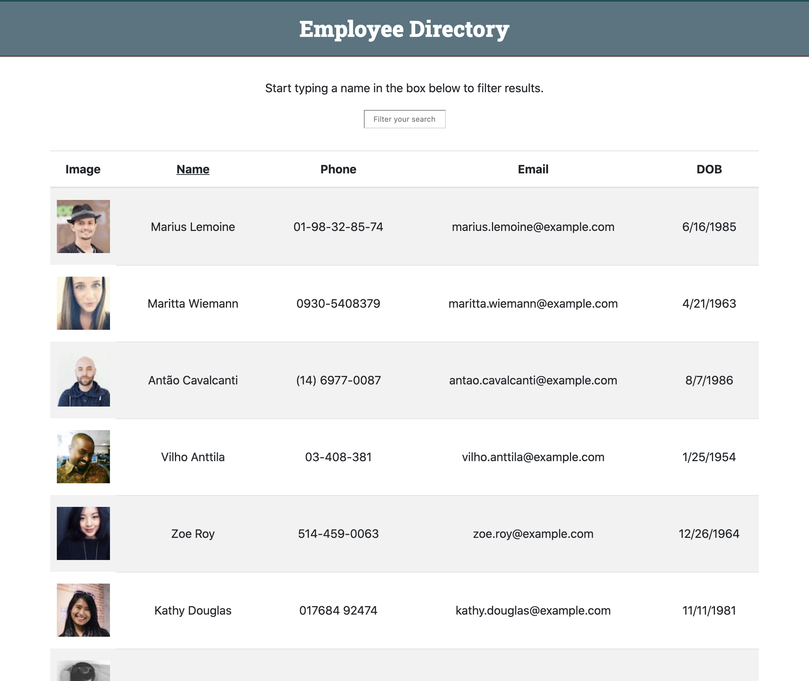

# React Employee Directory

Explore the [project page](https://github.com/cynthiwu/employee-directory)

View it live on [GitHub Pages](https://cynthiwu.github.io/employee-directory/)

## Table of Contents
- [About The Project](#about-the-project)
    - [Built With](#built-with)
- [Installation](#installation)
- [Usage](#usage)
  - [Demo](#demo)
- [Contributing](#contributing)
- [Contact](#contact)


## About The Project

The goal of this project was to build a simple Employee Directory application using React. The focus was on breaking up the application's UI into components and practice managing component state and responding to user events.  

<hr>



<hr>

### Built With

This project was built using:

* JavaScript
* [React](https://reactjs.org/)
* [Node.js](https://nodejs.org/api/fs.html)
* [Axios](https://www.npmjs.com/package/axios)
* [Random User API](https://randomuser.me/)

## Installation

While not necessary to run the program via the live link above, you may get a local copy up and running by following these simple steps:

1. Clone the repo
```sh
git clone git@github.com:cynthiwu/employee-directory.git 
```

2. Install NPM packages (i.e., Inquirer)
```sh
npm install
```

## Usage

This project can be used as a demonstration of React components and a framework for manipulating UI based on user action. In addition, it is a good example of the Random User API and how the data can be used. Randomly generated data can be swapped out for user entered data. 

### Demo

Watch the video below to see how the program works.


## Contributing

Contributions are what make the open source community such an amazing place to  learn, inspire, and create. Any contributions you make are **greatly appreciated**.

1. Fork the Project
2. Create your Feature Branch (`git checkout -b feature/AmazingFeature`)
3. Commit your Changes (`git commit -m 'Add some AmazingFeature'`)
4. Push to the Branch (`git push origin feature/AmazingFeature`)
5. Open a Pull Request

## Contact

Cynthia Wu - [@cynthia21wu](https://twitter.com/cynthia21wu) - cynthia21wu@gmail.com

Project Link: [https://github.com/cynthiwu/google-books-search](https://github.com/cynthiwu/google-books-search)

Live Link: []()
